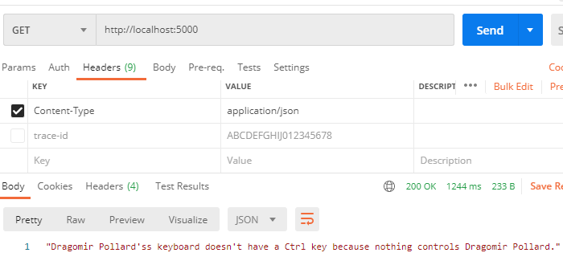

# Name-And-Fact Service #
Create a production-ready web service which combines two existing web services
1. Fetch a random name from https://names.mcquay.me/api/v0
2. Fetch a random Chuck Norris joke from http://api.icndb.com/jokes/random?firstName=John&lastName=Doe&limitTo=[nerdy]
3. Combine the results and return them to the user.
   
## Instructions ##

The REST api service is written in GO. It uses the Beego framework. If you don't have Beego installed on your computer, please refer to this link  (https://beego.me/docs/install/)

To run the application

```
 $ ~/path-to-the-solution-folder/bee run
```


The service listens on port 5000 and can be accessed with 'GET http://localhost:5000'. The image below shows an example of the service being called from Postman



## Implmentation Details  ##


# Requirements

    The web service should be written in Go, Python, Javascript, or Ruby.
    Write a README.md file which (at a minimum) provides instructions for running the web service.
    The web service should remain responsive under load and be able to support multiple concurrent requests.
    The code, README.md and any other supporting files should be compressed into a single archive and submitted for review by email.

Example
Fetching a name
$ curl https://names.mcquay.me/api/v0/
{"first_name":"Hasina","last_name":"Tanweer"}
Fetching a joke
$ curl 'http://api.icndb.com/jokes/random?firstName=John&lastName=Doe&limitTo=\[nerdy\]‘
{ "type": "success", "value": { "id": 181, "joke": "John Doe's OSI network model has only one layer - Physical.", "categories": ["nerdy"] } }
Using the new web service
$ curl 'http://localhost:5000‘
Hasina Tanweer's OSI network model has only one layer - Physical..


Guidelines

    Production ready is a broad goal: if you're unable to fully meet it then please include clear TODO comments in your code that are sufficiently detailed that another engineer could complete the task without having to do additional design thinking and the result would match your vision of production readiness.
    Please let us know how much time you spent on the task when you submit your answer.
